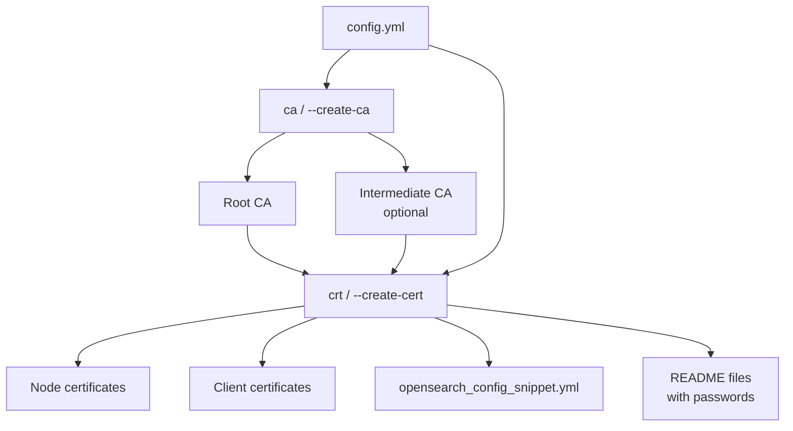

# OpenSearch Security Certificate Tool

A fast, cross-platform command-line tool for generating SSL/TLS certificates for OpenSearch Security clusters. This is a reimplementation of the original Java-based Search Guard TLS Tool in Go, providing easy-to-deploy single binaries for all major platforms.

## Features

- ✅ **Create Certificate Authorities** (root and intermediate CAs)
- ✅ **Generate node certificates** for OpenSearch clusters with SAN support
- ✅ **Generate client certificates** for authentication  
- ✅ **Encrypted private keys** with auto-generated passwords
- ✅ **CRL Distribution Points** support for certificate revocation
- ✅ **Node OID extensions** for OpenSearch Security compatibility
- ✅ **OpenSearch configuration generation** with 2-space YAML indentation
- 🔄 **Create Certificate Signing Requests (CSRs)** (coming soon)
- 🔄 **Certificate validation and diagnostics** (coming soon)
- ✅ **Cross-platform binaries** (Linux, macOS, Windows - AMD64 and ARM64)
- ✅ **YAML configuration** compatible with original Java tool format
- ✅ **No runtime dependencies** - single static binary

## Quick Start

### 1. Download Binary

Download the appropriate binary for your platform from the releases page or build from source.

### 2. Create Configuration

Create a `config.yml` file (see `examples/config.yml` for a complete example):

```yaml
ca:
  root:
    dn: CN=root.ca.example.com,OU=CA,O=Example Com\, Inc.,DC=example,DC=com
    keysize: 2048
    validityDays: 3650
    pkPassword: auto

  # Optional intermediate CA for enhanced security
  intermediate:
    dn: CN=signing.ca.example.com,OU=CA,O=Example Com\, Inc.,DC=example,DC=com
    keysize: 2048
    validityDays: 3650
    pkPassword: auto
    # CRL distribution points for certificate revocation
    crlDistributionPoints: URI:https://example.com/revoked.crl

defaults:
  validityDays: 3650
  httpsEnabled: true
  generatedPasswordLength: 12

nodes:
  - name: node1
    dn: CN=node1.example.com,OU=Ops,O=Example Com\, Inc.,DC=example,DC=com
    dns: node1.example.com
    ip: 10.0.2.1
  - name: node2
    dn: CN=node2.example.com,OU=Ops,O=Example Com\, Inc.,DC=example,DC=com
    dns: node2.example.com
    ip: 10.0.2.2

clients:
  - name: admin
    dn: CN=admin.example.com,OU=Ops,O=Example Com\, Inc.,DC=example,DC=com
    admin: true
```

### 3. Generate Certificates

```bash
# Create Certificate Authority
./opensearch-security-certtool ca --config config.yml

# Generate all certificates
./opensearch-security-certtool crt --config config.yml

# Alternative: Use long-form flags
./opensearch-security-certtool --create-ca --config config.yml
./opensearch-security-certtool --create-cert --config config.yml

# Use verbose output
./opensearch-security-certtool ca --config config.yml --verbose
```

## Workflow



## Commands

The tool supports both short-form subcommands and long-form flags for compatibility:

### `ca` / `--create-ca`
Creates a new Certificate Authority (root and optional intermediate CA).

```bash
opensearch-security-certtool ca --config config.yml [--verbose] [--target output_dir]
# OR
opensearch-security-certtool --create-ca --config config.yml [--verbose] [--target output_dir]
```

### `crt` / `--create-cert`
Generates node and client certificates signed by the CA, plus OpenSearch configuration snippets.

```bash
opensearch-security-certtool crt --config config.yml [--verbose] [--target output_dir]
# OR
opensearch-security-certtool --create-cert --config config.yml [--verbose] [--target output_dir]
```

### `csr` / `--create-csr` (Coming Soon)
Creates certificate signing requests.

```bash
opensearch-security-certtool csr --config config.yml [--verbose] [--target output_dir]
```

## Configuration

The tool uses YAML configuration files compatible with the original Java tool format. Key sections:

- **`ca`**: Certificate Authority configuration (root and optional intermediate)
- **`defaults`**: Default values applied to all certificates
- **`nodes`**: OpenSearch cluster node definitions with DNS names and IP addresses
- **`clients`**: Client certificate definitions for authentication

### Advanced Configuration Options

- **`pkPassword: auto`**: Generates secure random passwords automatically
- **`crlDistributionPoints`**: Specify CRL endpoints for certificate revocation
- **`nodeOid`**: Custom Node OID for OpenSearch Security compatibility
- **`httpsEnabled`**: Generate separate HTTP certificates for REST API
- **`useEllipticCurves`**: Generate ECDSA keys instead of RSA (see below)

See `examples/config.yml` for a complete configuration example.

### Elliptic Curve (ECDSA) Keys

By default, all keys (CA, node, and client) are generated as RSA keys, matching the tool's
historical behavior. To use ECDSA keys instead, set `useEllipticCurves: true` under `defaults`:

```yaml
defaults:
  useEllipticCurves: true
  ellipticCurve: P-384   # optional, this is the default
```

- **`useEllipticCurves`** (boolean, default `false`) is a global setting under `defaults` that
  switches key generation from RSA to ECDSA for the root CA, intermediate CA, node certificates,
  and client certificates. This mirrors the Java Search Guard TLS Tool's `useEllipticCurves`
  option.
- **`ellipticCurve`** (string, default `P-384`) selects the named curve. Supported values are
  `P-224`, `P-256`, `P-384`, and `P-521` (Go stdlib `crypto/elliptic` curves). It can be set under
  `defaults` for a global default, and overridden per CA under `ca.root.ellipticCurve` /
  `ca.intermediate.ellipticCurve`.
- When `useEllipticCurves` is `false` (or unset), `ellipticCurve` and `keysize` behave exactly as
  before — RSA keys are generated at the configured `keysize` (default 2048 bits).
- Encrypted private keys (`pkPassword: auto` or an explicit password) work the same way for
  ECDSA keys as for RSA keys.

See `tests/elliptic-curves-test.yml` for a complete example.

## Building from Source

### Prerequisites
- Go 1.21 or later

### Build Commands

```bash
# Build for current platform
make build

# Build for all platforms
make build-all

# Run tests
make test

# Run linter
make lint

# Update dependencies
make update-deps

# Run with example config
make run
```

### Development Features

- **Comprehensive testing** with unit and integration tests in `tests/` directory
- **Security validation** for certificates and configurations  
- **Structured error handling** with detailed context
- **Template-based string management** - no hardcoded strings in source code
- **Code quality checks** with golangci-lint
- **CI/CD pipeline** with automated security scanning
- **Cross-platform builds** for easy deployment

### Cross-Platform Builds

The Makefile supports building for:
- Linux (AMD64, ARM64)
- macOS (AMD64, ARM64) 
- Windows (AMD64, ARM64)

All binaries are statically linked with no runtime dependencies.

## Output

### Certificates and Keys (PEM format)
- `root-ca.pem` / `root-ca.key` - Root CA certificate and private key
- `signing-ca.pem` / `signing-ca.key` - Intermediate CA (if configured)
- `{node-name}.pem` / `{node-name}.key` - Node certificates with transport encryption
- `{node-name}_http.pem` / `{node-name}_http.key` - HTTP certificates (if separate from transport)
- `{client-name}.pem` / `{client-name}.key` - Client certificates for authentication

### Configuration and Documentation
- `{node-name}_opensearch_config_snippet.yml` - Configuration snippets for each node (2-space YAML indentation)
- `root-ca.readme` - Auto-generated passwords for CA private keys
- `client-certificates.readme` - Documentation for client certificate usage

The configuration snippets are ready to be inserted into each node's `opensearch.yml` file and use proper 2-space YAML indentation for consistency.

### Security Features

- **Encrypted Private Keys**: All private keys are encrypted using PKCS#8 with AES-256-CBC
- **Auto-Generated Passwords**: Secure random passwords (12+ characters) stored in README files
- **Password Resolution**: Tool automatically loads encrypted keys using stored passwords
- **CRL Support**: Certificate Revocation List distribution points for security management
- **Node OID Extensions**: Proper OpenSearch Security node identification

## Compatibility

This tool generates certificates compatible with:
- OpenSearch Security
- Elasticsearch with Search Guard
- Any system requiring X.509 certificates

Certificate formats and extensions match the original Java tool for seamless migration.

## Credits

This project is inspired by and maintains compatibility with the original [Search Guard TLS Tool](https://github.com/floragunncom/search-guard-tlstool) developed by floragunn GmbH. We acknowledge and appreciate their pioneering work in OpenSearch/Elasticsearch security tooling.

The configuration format, certificate generation workflow, and output structure are designed to be compatible with the original Java-based Search Guard TLS Tool, enabling seamless migration and cross-platform deployment.

## License

Licensed under the Apache License, Version 2.0. See LICENSE file for details.

## Migration from Java Tool

This Go implementation is designed as a drop-in replacement for the original Java-based tool:

1. **Same configuration format** - existing YAML configs work unchanged
2. **Same certificate output** - generates identical certificate structures with proper extensions
3. **Same command-line interface** - familiar flags and options plus convenient short-form commands
4. **Better deployment** - single binary instead of Java dependencies
5. **Enhanced security** - improved password management and encryption handling

Simply replace the Java tool with the appropriate binary for your platform. Generated certificates and configuration snippets are fully compatible.

### Known Issue: Loading CA Keys Generated by the Java Search Guard TLS Tool

When loading a CA created by the original Java `sgtlstool`, you may see:

```
Error: failed to load CA: failed to decrypt private key: unsupported private key encryption algorithm: 1.2.840.113549.1.12.1.3
```

**Cause:** Java's `SunJCE` provider historically encrypts PKCS#8 `ENCRYPTED PRIVATE KEY` files using the legacy PKCS#12 password-based encryption scheme `pbeWithSHA1And3-KeyTripleDES-CBC` (OID `1.2.840.113549.1.12.1.3` - SHA-1 key derivation with 3-key Triple DES/3DES-CBC encryption). This tool supports the modern, standard PKCS#8 scheme (PBES2 with PBKDF2 and AES-CBC/3DES-CBC), but does not implement the older PKCS#12-style PBE scheme, since it relies on a weak, deprecated hash (SHA-1) and cipher (3DES) that should not be used for new keys.

**Workaround:** Convert the key to PBES2 using OpenSSL before loading it with this tool:

```bash
# 1. Decrypt with the current password (check the CA's .readme file if it used an auto-generated password)
openssl pkcs8 -in root-ca.key -out root-ca-key.decrypted.pem

# 2. Re-encrypt using PBES2 with PBKDF2-HMAC-SHA256 and AES-256-CBC
openssl pkcs8 -in root-ca-key.decrypted.pem -topk8 \
  -v2 aes-256-cbc -v2prf hmacWithSHA256 \
  -out root-ca.key

# 3. Securely remove the decrypted intermediate file
shred -u root-ca-key.decrypted.pem
```

You'll be prompted for the current password in step 1 and a (new or reused) password in step 2 - the password from step 2 is what you should set as `pkPassword` in your config going forward. Verify the conversion succeeded with:

```bash
openssl asn1parse -in root-ca.key | head -5
# Should show PBES2 and PBKDF2, not pbeWithSHA1And3-KeyTripleDES-CBC
```

This is a one-time migration step per CA/node/client key generated by the Java tool. Keys created by this tool itself already use a supported encryption scheme and do not need conversion.

### Certificate Subject Encoding: Matching OpenSearch's `nodes_dn` Matching

**Problem:** A certificate's subject Distinguished Name (DN) is a sequence of attributes (`CN`, `OU`, `O`, `DC`, ...). X.509 stores that sequence in a specific binary (DER) order, but the human-readable order you write in `dn:` and the order OpenSearch actually matches against `plugins.security.nodes_dn` are not the same thing, and naively "preserving" the `dn:` order in the DER encoding produces certificates that fail to join an existing cluster.

Concretely, for `dn: CN=node.example.com,OU=Example,O=Example Org,DC=opensearch,DC=example,DC=com`:

| Representation | Order |
|---|---|
| `dn:` string in your config (what you write) | `CN` → `OU` → `O` → `DC` → `DC` → `DC` |
| `openssl x509 -subject` / `-nameopt RFC2253` (human-readable display) | `DC` → `DC` → `DC` → `O` → `OU` → `CN` |
| **Certificate's actual DER encoding** (what this tool must produce) | `DC` → `DC` → `DC` → `O` → `OU` → `CN` |
| **OpenSearch's matched "SSL Principal"** (what `nodes_dn` wildcards match against) | `CN` → `OU` → `O` → `DC` → `DC` → `DC` |

The DER encoding is the *reverse* of the `dn:` string, and the OpenSearch principal is the DER encoding reversed *again* - so it ends up matching your `dn:` string's order after all, just not directly.

**Why:** OpenSearch Security's `DefaultPrincipalExtractor` does not compare the DER bytes or the RFC2253 display string directly. It:

1. Reads the certificate's `X500Principal` string, which Java renders in RFC2253 order (the reverse of the DER encoding).
2. Re-parses that string with `javax.naming.ldap.LdapName`, which preserves the string's left-to-right order (i.e. still reversed from DER).
3. Reverses that parsed list a second time, undoing step 1's reversal.
4. Joins the result into the "SSL Principal" string used for `plugins.security.nodes_dn` wildcard matching.

Steps 1 and 3 cancel out, so the principal OpenSearch matches equals the certificate's **DER encoding order, as-is**. The legacy Java Search Guard `sgtlstool` DER-encodes DC-first (the reverse of the CN-first `dn:` string convention), so that after this extraction its principals come out CN-first and match typical `CN=*.example.com,...` wildcards.

**How this tool handles it:** Certificates are DER-encoded in the *reverse* of the `dn:` string's attribute order (`internal/cert/cert.go`, `buildOrderedRawSubject`), matching the Java tool's behavior. You do not need to change how you write `dn:` strings in your config - write them CN-first as usual, and the resulting certificate will produce the same OpenSearch principal, and match the same `nodes_dn` wildcards, as a certificate for the same `dn:` issued by the Java `sgtlstool`.

**Verifying a certificate's principal:** Since neither the default `-subject` display nor `-nameopt RFC2253` show what OpenSearch actually matches, check the DER order directly:

```bash
# Shows attributes in actual DER (encoding) order, top to bottom
openssl x509 -in node.pem -noout -subject -nameopt multiline
```

For the CN-first `dn:` example above, this should print `DC` first and `CN` last - reading the lines bottom-to-top gives you the OpenSearch principal order (`CN` → `OU` → `O` → `DC` → `DC` → `DC`), which should match your original `dn:` string.

### Never Silently Creates a New CA

If you run `crt` / `create-cert` in an output directory that has a leftover `root-ca.readme` (or the intermediate CA's readme) but is missing the corresponding `.pem`/`.key` files - for example, an operator only copied some of an existing cluster's CA material when provisioning a new node - the tool refuses to proceed instead of silently minting a brand new CA:

```
Error: found out/root-ca.readme but no out/root-ca.pem: refusing to create a new CA that
would not match the existing cluster; copy the original root-ca.pem and root-ca.key into
out before running crt/create-cert
```

A silently-created new CA would sign new node certificates that don't chain to the cluster's existing trust anchor, causing those nodes to fail to join even though the tool reports success. Copy the original CA's `.pem`, `.key`, and `.readme` files into the output directory before running `crt` when expanding an existing cluster.
